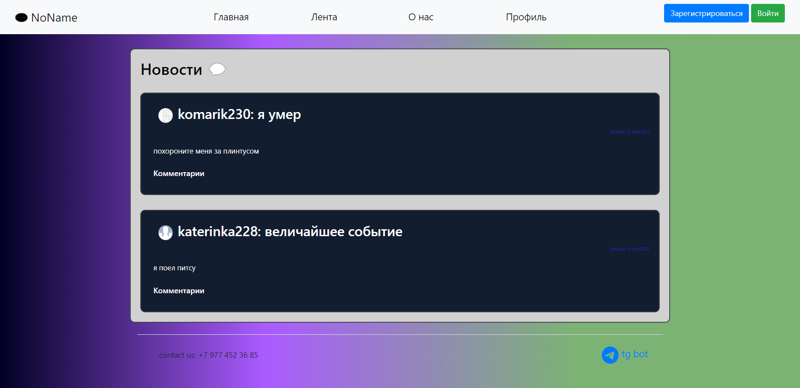

# NoName #
Мотивирующий сервер с цитатами, календарем для планирования, системой авторизации, при регистрации в которой появляется возможность публиковать привычки и новости. Также есть возможность загружать картинку пользователя.


 

### Описание ### 
* На стартовой странице вебсайта пользователь может воспользоваться такими функциями, как Планер, мемы, мотивирующие цитаты, праздник дня
* Авторизованные пользователи могут публиковать новости и создавать привычки
* Если пользователь не авторизован (или не зарегистрирован), то он может просматривать чужие новости и привычки, а также пользоваться всем функционалом главной страницы
* Если пользователь не был зарегистрирован ранее, ему будет предложено авторизоваться (зарегистрироваться)....   

* На странице /planer можно воспользоваться полноценным календарем на промежуток день/неделя/месяц  

* На странице /motivation можно получить разные мотивирующие цитаты 

* На странице /holiday можно узнать какие праздники отмечаются по всему миру

* На странице /news можно ознакомиться с постами других пользователей сайта

* Личный кабинет, в котором можно установить аватарку, указать свои интересы, данные, создать привычку или новость, которые будут видны другим пользователям

* Бот предназначен для ...  Команды бота ...  
 

 

### Технологии в проекте ###

Приложение написано на языке программирования Python c использованием микро-фреймворка flask. 

В папке templates хранятся HTML-шаблоны. 
При создании форм используется объектный подход с помощью библиотеки flask-wtf.
Веб-приложение работает с базой данных через ORM sqlalchemy.

Все необходимые ресурсы хранятся в папке static. Собственные стили описаны в файле style.css.

Регистрационные данные пользователей, привычки, новости, хранятся в базе данных SQLite habits.db   
Пароли хранятся в БД в хешированном виде. 

### Техническое описание проекта ###
Для запуска приложения необходимо запустить файл main.py  

Тестовый пользователь: web_yl2023@mail.ru (пароль: 1111) 

Для запуска бота: 
1. Зарегистрировать своего бота и получить API-TOKEN: ( https://core.telegram.org/bots/api )
2. Создать в проекте файл **.env** со следующим содержанием:

```
API_TOKEN=<YOU-API-TELEGRAM-TOKEN>
```

(Чтобы установить все зависимости 
достаточно в консоли (терминале) вызвать команду  
pip install -r requirements.txt

Проект размещен в интернете по адресу: 
